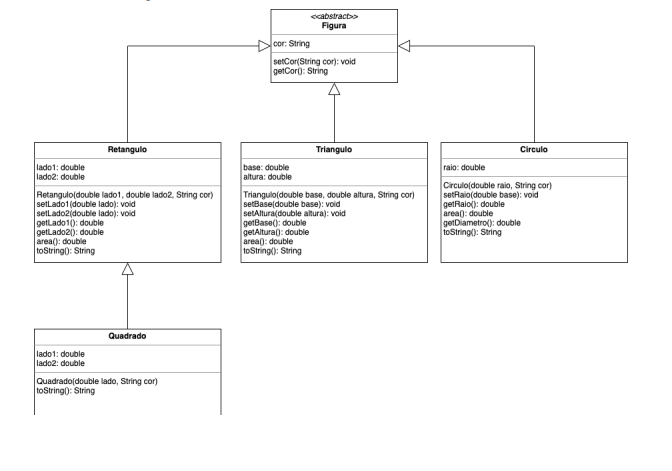

# POO | Atividade IV - Trabalho Final

## Introdução

Neste trabalho o objetivo da sua equipe é desenvolver o sistema apresentado no
diagrama de classe.

## Alunos

- Leonardo de Camargo Falcoski
- Vinícius Santana Ribeiro

## Instruções gerais quanto a implementação

Para esta atividade, você deve:

- Implementar as classes solicitadas no projeto
- Testar a implementação

## Projeto

O projeto tem por objetivo implementar um sistema de figuras, conforme o diagrama
de classes a seguir.

